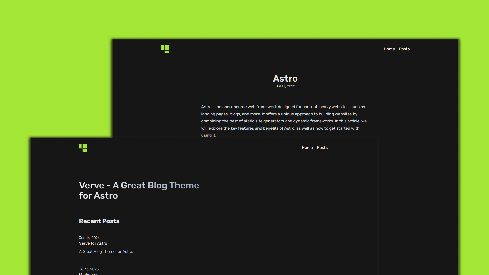

# Verve 🔥



Verve is a minimal blog theme for Astro.

Verve follows best practices for a blog website.

## 🎉 Features

- Awesome Performance
- SEO Optimized
- Sitemap and RSS

## ✅ Lighthouse Score

<p align="center">
  <a href="https://pagespeed.web.dev/analysis/https-vervetheme-vercel-app/a84yqse61a?form_factor=desktop">
    
  <a>
</p>

## 🚀 Project Structure

Inside of Verve, you'll see the following folders and files:

```text
/
├── public/
│   └── favicon.svg
├── src/
│   ├── components/
│   ├── content/
│   │   └── blog/
│   ├── layouts/
│   ├── pages/
│   │   └── index.astro
│   └── config.ts
└── package.json
```

Astro looks for `.astro` or `.md` files in the `src/pages/` directory. Each page is exposed as a route based on its file name.

Any static assets, like images, can be placed in the `public/` directory.

All blog posts are stored in `src/content/blog` directory.

## 🧞 Commands

All commands are run from the root of the project, from a terminal:

| Command                    | Action                                           |
| :------------------------- | :----------------------------------------------- |
| `pnpm install`             | Installs dependencies                            |
| `pnpm run dev`             | Starts local dev server at `localhost:4321`      |
| `pnpm run build`           | Build your production site to `./dist/`          |
| `pnpm run preview`         | Preview your build locally, before deploying     |
| `pnpm run astro ...`       | Run CLI commands like `astro add`, `astro check` |
| `pnpm run astro -- --help` | Get help using the Astro CLI                     |

## 📜 License

**Verve** is licensed under the [MIT License](https://opensource.org/licenses/MIT).
